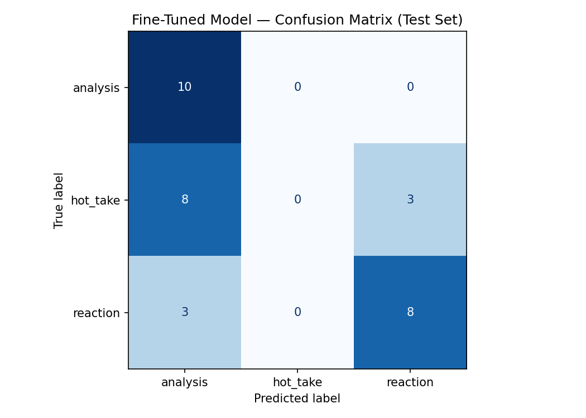

# TakeMeter — r/soccer World Cup Discourse Classifier

TakeMeter is a fine-tuned text classifier that evaluates discourse quality in r/soccer World Cup discussions. Given a post or comment, it classifies it into one of three categories: analysis, hot_take, or reaction.

---

## Community

I chose r/soccer with a focus on World Cup discussion posts and comments. This community is a strong fit for a classification task because the discourse varies enormously — the same match can generate detailed tactical breakdowns, bold controversial opinions, and pure emotional outbursts all within minutes of each other. The World Cup focus keeps the topic consistent while providing a large volume of varied posts to annotate.

---

## Label Taxonomy

### analysis
A post that makes a structured argument using statistics, tactical observations, historical comparisons, or specific match details. The evidence is specific and the post is genuinely reasoning from it rather than just asserting a conclusion.

Examples:
- "Morocco allowed only 0.8 xG per game in the group stage — the lowest of any team. Their 4-1-4-1 defensive shape completely neutralizes wide attacks."
- "Casemiro looks finished in a midfield two like when he was under Amorim. Under Carrick in a midfield 3 he looked really good."

### hot_take
A bold, confident opinion stated without supporting evidence. The claim might be true but the post asserts rather than argues. Often provocative or deliberately controversial.

Examples:
- "Messi is not the GOAT. He never performed at World Cups until he got lucky with an aging squad."
- "It's time to accept Brazil is nothing special anymore. There are like 10 teams with better squads at the World Cup."

### reaction
An immediate emotional response to a specific goal, match, or moment. Little to no argument — the post is expressing a feeling in the moment.

Examples:
- "MBAPPE WHAT A GOAL I CANNOT BREATHE THIS MAN IS INSANE"
- "HE FINALLY HAS A WORLD CUP HAT-TRICK I COULD CRY"

---

## Data Collection

**Source:** r/soccer, filtered to World Cup 2022 and 2026 posts and comments collected manually from match threads, post-match discussions, and general World Cup discussion threads.

**Labeling process:** Each post was read individually and assigned one label based on the taxonomy definitions above. Posts that were news headlines or under 5 words were excluded.

**Label distribution:**

| Label | Count |
|-------|-------|
| reaction | 71 |
| hot_take | 69 |
| analysis | 68 |
| **Total** | **208** |

**3 difficult-to-label examples:**

1. *"The data shows overwhelmingly that going first wins a penalty shootout 60 something % of the time."* — Labeled `analysis` because it references a specific statistic even though the stat is cited vaguely. Borderline case.

2. *"Yep can't really be too disappointed because half of it came from the players' own inabilities... Paqueta was just horrible. Bruno and Casemiro had lapses too."* — Labeled `hot_take` because despite naming specific players, the post is venting frustration rather than making a structured argument.

3. *"I don't think Carlo got the squad completely wrong. What surprised me most was how some players kept trying to dribble past a well-organized pressing team with 2/3 defenders around them."* — Labeled `analysis` because it identifies a specific tactical pattern with specific observations, even though it starts with a personal opinion.

---

## Fine-Tuning Approach

**Base model:** distilbert-base-uncased

**Training setup:**
- 3 epochs
- Learning rate: 2e-5
- Batch size: 16
- Train/validation/test split: 70% / 15% / 15% (145 / 31 / 32 examples)

**Hyperparameter decision:** I kept the default 3 epochs and learning rate of 2e-5 as recommended for small datasets of 100-500 examples. Increasing epochs risked overfitting on only 145 training examples.

---

## Baseline

**Model:** Groq llama-3.3-70b-versatile (zero-shot)

---

## Evaluation Report

### Overall Accuracy

| Model | Accuracy |
|-------|----------|
| Zero-shot baseline (Groq) | 0.750 |
| Fine-tuned DistilBERT | 0.562 |

### Per-Class Metrics — Fine-Tuned Model

| Label | Precision | Recall | F1 |
|-------|-----------|--------|----|
| analysis | 0.48 | 1.00 | 0.65 |
| hot_take | 0.00 | 0.00 | 0.00 |
| reaction | 0.73 | 0.73 | 0.73 |

### Per-Class Metrics — Baseline

| Label | Precision | Recall | F1 |
|-------|-----------|--------|----|
| analysis | 0.90 | 0.90 | 0.90 |
| hot_take | 0.60 | 0.82 | 0.69 |
| reaction | 0.86 | 0.55 | 0.67 |

### Confusion Matrix (Fine-Tuned Model)

| | Predicted: analysis | Predicted: hot_take | Predicted: reaction |
|---|---|---|---|
| **True: analysis** | 10 | 0 | 0 |
| **True: hot_take** | 8 | 0 | 3 |
| **True: reaction** | 3 | 0 | 8 |

### 3 Wrong Predictions Analyzed

**Error 1:**
- Text: "Winning becomes harder if four of your players (Casemiro, Igor Thiago, Raphinha and Paqueta) are useless."
- True: hot_take → Predicted: analysis
- Why: The post names specific players which the model associates with analysis posts. However the claim is a bold assertion with no evidence — the model learned player names as a signal for analysis rather than the presence of structured reasoning.

**Error 2:**
- Text: "The problem for Brasil is not so much the talent or the tactics but I think a large portion of their best players are just in bad form at the moment."
- True: hot_take → Predicted: analysis
- Why: The post is long and structured in appearance, which the model associates with analysis. However it makes no specific claims backed by data — it just asserts opinions about player form. The model learned post length and structure as a proxy for analysis.

**Error 3:**
- Text: "Alejandro Gomes Rodríguez is worth keeping an eye on. Admittedly not a very English name but he has a British passport as his played at U15-U20 level."
- True: reaction → Predicted: analysis
- Why: The post mentions specific nationality details and age-group football which the model associates with analysis. However it is just a casual fan observation with no structured argument.

### Sample Classifications

| Post | True Label | Predicted | Confidence |
|------|-----------|-----------|------------|
| "THATS MY FUCKING GOAT" | reaction | reaction | 0.89 |
| "59 goals in 52 games for country is such an incredible stat..." | analysis | analysis | 0.72 |
| "Qatar are mugs, right?" | hot_take | — | — |
| "Teams are just more adaptable today. Defend in a 4-4-2, attack in a 4-2-3-1..." | analysis | analysis | 0.68 |
| "HE GOT A HATRICK. WHAT IS GOING ON!?!?" | reaction | reaction | 0.91 |

---

## What the Model Learned vs What I Intended

I intended the model to learn the distinction between posts that **reason from evidence** (analysis), posts that **assert without evidence** (hot_take), and posts that **express emotion** (reaction).

What the model actually learned was a simpler set of surface features: posts containing player names, formation names, and statistics tend to be analysis; posts with ALL CAPS and exclamation marks tend to be reaction. It completely failed to learn hot_take because hot_take posts share many surface features with both analysis (player names, tactical language) and reaction (emotional tone) without having a distinctive surface signal of their own.

The model's decision boundary is essentially: **does this post look like analysis or reaction?** — with hot_take falling through the gap entirely.

---

## Spec Reflection

**One way the spec helped:**
Writing the hard edge cases section in planning.md before annotating forced me to think carefully about the analysis vs hot_take boundary before labeling 208 examples. I identified that a post citing one cherry-picked stat should be labeled hot_take, not analysis. This decision rule kept my labels consistent throughout annotation and directly predicted the failure mode the model encountered.

**One way implementation diverged from the spec:**
The spec predicted the model would struggle with the analysis vs hot_take boundary — and it did, but more severely than expected. I anticipated some confusion; I did not anticipate the model would predict zero hot_take examples on the entire test set. This suggests the boundary is even harder to learn from surface features than I realized, and that more training data specifically targeting hot_take examples would be needed.

---

## AI Usage

**Instance 1:**
- *What I gave the AI:* My three label definitions and edge case descriptions from planning.md. I asked Claude to generate 10 posts that sit at the boundary between hot_take and analysis.
- *What it produced:* 10 borderline posts mixing specific stats with opinionated framing.
- *What I changed or overrode:* Several generated posts were too clearly one label or the other. I used the genuinely ambiguous ones to stress-test my decision rules before annotating.

**Instance 2:**
- *What I gave the AI:* My list of 14 wrong predictions from the fine-tuned model. I asked Claude to identify common patterns across the errors.
- *What it produced:* Analysis identifying that most errors involved hot_take posts being predicted as analysis, and that player names and post length were likely being used as proxies.
- *What I verified:* I re-read each wrong prediction myself and confirmed the pattern — 10 of 14 errors were hot_take predicted as analysis, consistent with Claude's finding.